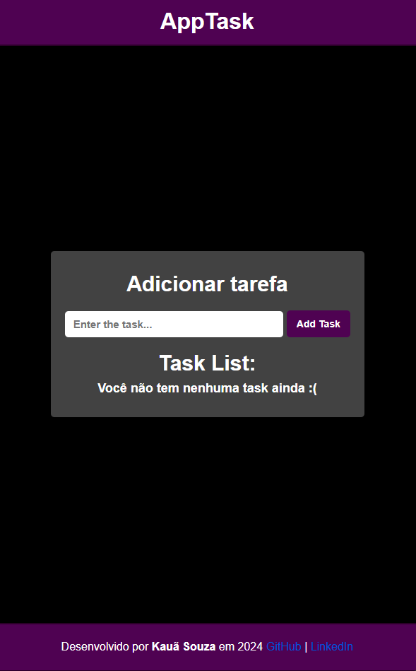
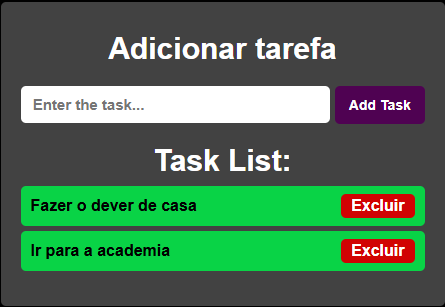

# 🧑‍💻To-DoList

## 📖 Sobre:

Esse projeto é uma **lista de tarefas (To-Do List)** onde o usuário pode:

1. Cadastrar novas tarefas
2. Excluir tarefas existentes

O projeto foi criado com o objetivo de **praticar JavaScript**, além de aprimorar o uso de **HTML e CSS**.

## 🚀 Tecnologias utilizadas

- **HTML5**
- **CSS3**
- **JavaScript (ES6+)**

## 🎯 Objetivo

Praticar o desenvolvimento front-end utilizando:
**HTML semântico**, **CSS para estilização e responsividade**, e **JavaScript** para manipulação do DOM e armazenamento de dados no `localStorage`.

## 💡 O que aprendi

Durante o desenvolvimento deste projeto, aprimorei as seguintes habilidades:

- Criar uma estrutura **HTML semântica e organizada**
- Utilizar **Flexbox** para alinhamento de elementos
- Aplicar **efeitos de hover** e **transições suaves**
- Armazenar dados no **Local Storage**

## 🖼️ Prévia do projeto

---

📅 Projeto criado para estudos e prática pessoal.
